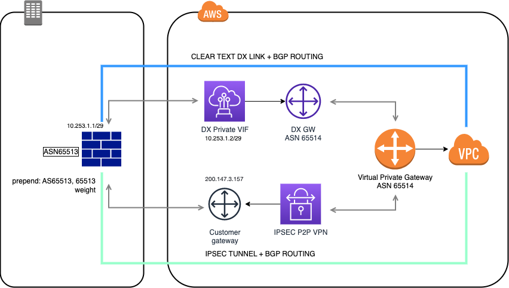

# Gerenciar recursos de rede e conectividade

O Amazon Virtual Private Cloud (Amazon VPC) oferece controle total sobre seu ambiente de redes virtual, incluindo posicionamento de recursos, conectividade e segurança.

Seus recursos da AWS são provisionados automaticamente em uma VPC padrão pronta para uso que foi criada para você. Você pode configurar essa VPC adicionando ou removendo sub-redes, acoplando gateways de rede, alterando a tabela de rotas padrão e modificando as ACLs da rede.

## Private connection

## Referências

### VPC

- https://aws.amazon.com/certification/certified-sysops-admin-associate
- https://aws.amazon.com/blogs/apn/amazon-vpc-for-on-premises-network-engineers-part-one/
- https://docs.aws.amazon.com/AWSEC2/latest/UserGuide/using-regions-availability-zones.html
- https://health.aws.amazon.com/health/status
- https://aws.amazon.com/pt/about-aws/global-infrastructure/localzones/features/
- https://www.lastweekinaws.com/blog/what-is-an-edge-location-in-aws-a-simple-explanation/#:~:text=Edge%20locations%20are%20AWS%20data,can%20be%20fast%20and%20snappy
- https://blog.ipspace.net/2021/02/vpc-subnets-aws-azure-gcp.html
- https://en.wikipedia.org/wiki/Private_network
- https://cidr.xyz/
- https://docs.aws.amazon.com/vpc/latest/userguide/nat-gateway-scenarios.html
- https://medium.com/awesome-cloud/aws-difference-between-security-groups-and-network-acls-adc632ea29ae
- https://docs.aws.amazon.com/vpc/latest/userguide/vpc-network-acls.html#nacl-ephemeral-ports
- https://docs.aws.amazon.com/pt_br/vpc/latest/userguide/amazon-vpc-limits.html

### Private Connections

- https://aws.amazon.com/blogs/apn/amazon-vpc-for-on-premises-network-engineers-part-two/
- https://aws.amazon.com/directconnect/partners/
- https://docs.aws.amazon.com/systems-manager/latest/userguide/session-manager.html
- https://docs.aws.amazon.com/vpc/latest/peering/peering-configurations-full-access.html#three-vpcs-full-access
- https://docs.aws.amazon.com/whitepapers/latest/aws-privatelink/what-are-vpc-endpoints.html

### Route 53

- https://www.networkstraining.com/what-is-dns/
- https://www.hostinger.com/tutorials/what-is-dns#How_Does_DNS_Work
- https://medium.com/networks-security/dns-queries-recursive-and-iterative-cdb73e290299
- https://www.iana.org/domains/root/db
- https://registro.br/dominio/categorias/
- https://docs.aws.amazon.com/Route53/latest/DeveloperGuide/Welcome.html
- https://docs.aws.amazon.com/Route53/latest/DeveloperGuide/ResourceRecordTypes.html
- https://docs.aws.amazon.com/Route53/latest/DeveloperGuide/resolver.html
- https://docs.aws.amazon.com/Route53/latest/DeveloperGuide/routing-policy.html

### Cloud Front

- https://www.javatpoint.com/aws-cloudfront-cdn
- https://docs.aws.amazon.com/pt_br/AmazonCloudFront/latest/DeveloperGuide/HowCloudFrontWorks.html#CloudFrontRegionaledgecaches
- https://www.feitsui.com/en/article/3
- https://docs.aws.amazon.com/pt_br/AmazonCloudFront/latest/DeveloperGuide/Expiration.html
- https://docs.aws.amazon.com/AmazonCloudFront/latest/DeveloperGuide/private-content-restricting-access-to-origin.html
- https://docs.aws.amazon.com/AmazonCloudFront/latest/DeveloperGuide/AccessLogs.html
- https://en.wikipedia.org/wiki/List_of_HTTP_status_codes
- https://docs.aws.amazon.com/AmazonCloudFront/latest/DeveloperGuide/troubleshooting-response-errors.html
- https://docs.aws.amazon.com/AmazonCloudFront/latest/DeveloperGuide/Expiration.html
- https://docs.aws.amazon.com/AmazonCloudFront/latest/DeveloperGuide/origin-shield.html